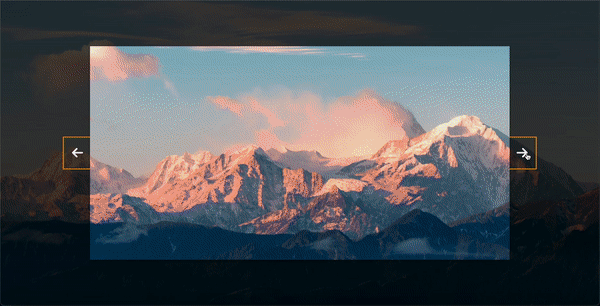

# Background Slider
A simple web application that allows users to cycle through a collection of background images for their website.

## Preview

## Technologies Used

- HTML
- CSS
- JavaScript

## Features

- Cycle through a collection of background images.
- Smooth transition between images.
- Automatic slideshow functionality.
- Manual navigation controls.
- Customizable slide duration and transition effects.
- Responsive design for various screen sizes.

## Getting Started

To get a local copy of the project, you can follow these steps:

1. Clone the repository: git clone https://github.com/your-username/background-slider.git
2. Open the index.html file in your web browser.

## Usage

1. Open the web application in your browser.
2. The background image will automatically transition to the next image in the collection.
3. Use the navigation controls to manually navigate through the images.
4. Adjust the slide duration and transition effects as desired.

Feel free to customize the project according to your needs. You can modify the HTML, CSS, and JavaScript code to add additional features or change the design.

## License

This project is licensed under the [MIT License](LICENSE).

## Acknowledgement

The project is part of the "50 projects in 50 days - HTML, CSS & Javascript" course on Udemy by Brad Traversy.

